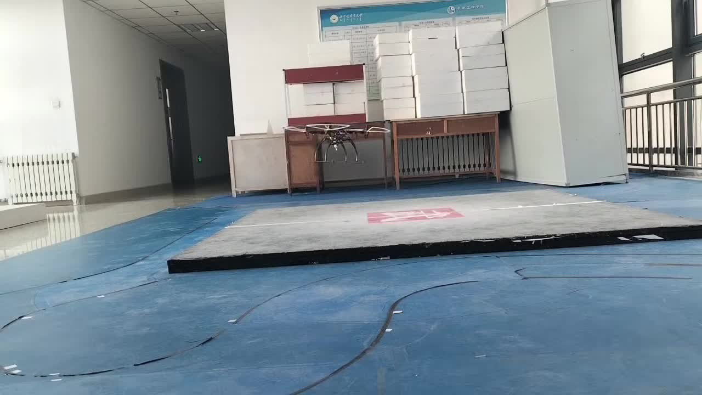
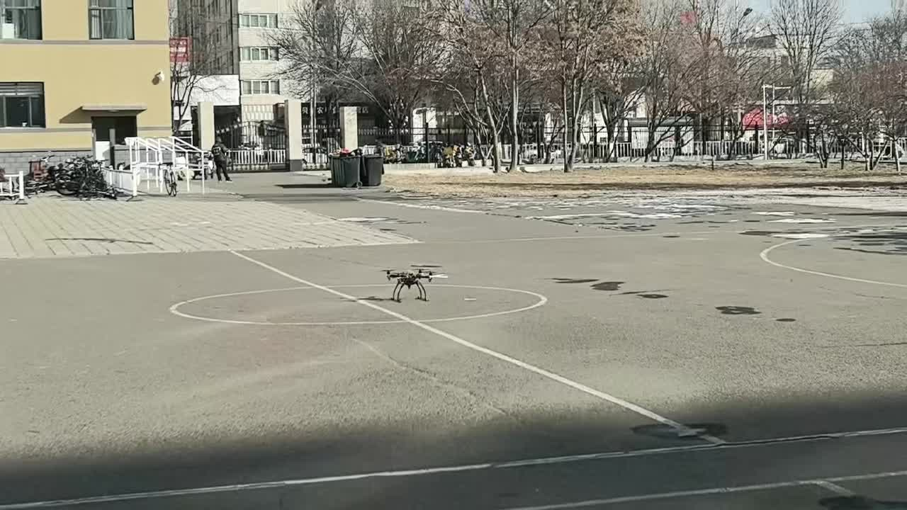
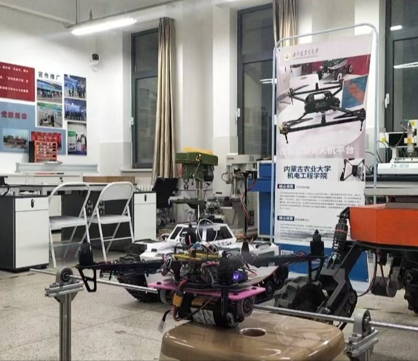
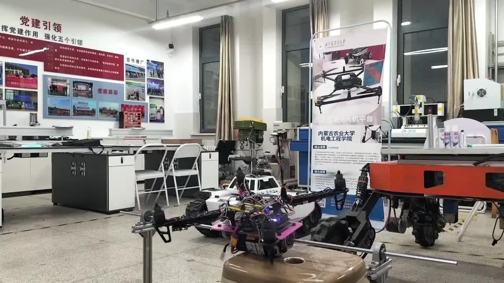
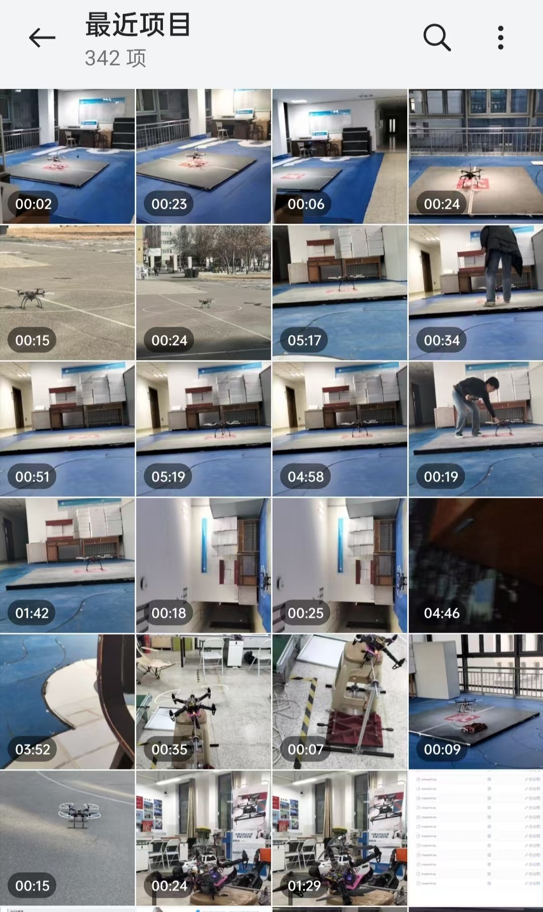

# STM32 自研飞控系统

**我基于 STM32F407 开发的一套四旋翼飞行控制固件。** 从 BMI088 采集、时间戳处理、姿态估计、闭环控制，到电机输出与异常保护，我希望自己打通这条完整的嵌入式控制链，而不只是把 PID 跑起来。

`STM32F407` · `BMI088` · `SPI DMA` · `Ring Buffer` · `Mahony` · `Cascaded Control` · `Failsafe`

[飞控源码](firmware/stm32/) · [Keil 工程](firmware/stm32/MDK-ARM/fly1.0.uvprojx) · [第三方组件](THIRD_PARTY_NOTICES.md)

## 实物、台架与试飞记录

从台架约束测试到室内、室外试飞，我保留了一些原始视频和现场照片。它们不属于精心剪辑的航拍作品，而是我开发这套飞控时真实留下的实验记录。

### 室内与室外试飞

| 室内试飞 · 20 秒 | 室外试飞 · 14 秒 |
| :---: | :---: |
|  |  |
| [▶ 查看室内原始片段](media/flight/indoor-test.mp4) | [▶ 查看室外原始片段](media/flight/outdoor-test.mp4) |

室内视频记录了起降垫附近的短时试飞；室外视频记录了开阔场地内的近地试飞过程。这里不依据画面宣称定点精度、长时间稳定悬停或其他未经测量的性能指标。

### 台架调试

| 约束台架实物 | 台架动态测试视频 · 5.6 秒 |
| :---: | :---: |
|  |  |
| 固定装置、机体和实验环境 | [▶ 查看台架测试片段](media/bench/bench-test.mp4) |

台架测试用于观察机体在约束条件下的动态响应，帮助我逐步排查控制方向、输出行为与振荡问题。受机械约束影响，这类响应不能直接等同于自由飞行性能。

> **关于这些视频：** 这是自研原型机在早期调试阶段的记录。当时我的手动飞行操作经验也还有限，调参、机体状态和操作技术都处在不断磨合的过程中，因此画面中的飞行和拍摄表现并不总是平稳。我选择保留实际过程，而不是把它们包装成成熟产品的飞行演示。

### 我保留的调试过程影像

这张相册截图展示了我长期保存的调试影像，包括台架、室内场地和室外试飞等。相册的项目数量不代表独立试飞次数，也不代表每一项都属于同一版固件。

## 系统架构

我将软件组织为传感器采集、数据缓存与时间配对、姿态估计、飞行控制、电机输出和安全管理几个部分。SBUS 遥控输入和气压高度处理作为独立功能进入主控制链。

| 子系统 | 工程实现 |
| --- | --- |
| 主控 | STM32F407ZGTx / Cortex-M4F，HSI/PLL 标称 SYSCLK 168 MHz |
| IMU | BMI088 加速度计与陀螺仪独立 DRDY，SPI1 DMA 采集 |
| 姿态估计 | 我编写的 Mahony 六轴四元数融合代码，配合时间戳样本处理 |
| 飞行控制 | Roll/Pitch 角度外环 P、角速度内环 PD，独立 Yaw 控制与四旋翼混控 |
| 气压与高度 | 我编写的 MS5611 驱动，以及高度、垂直速度与定高相关逻辑 |
| 输入输出 | USART6 DMA SBUS 接收、四路 PWM 输出 |
| 保护机制 | 采样新鲜度、DMA 超时恢复、解锁条件与故障锁存 |

## 我重点设计的实时数据链

**异步采集。** 我用 BMI088 ACC/GYR 的 DRDY 记录事件和时间戳，通过 SPI DMA 执行传输，避免在传感器中断里等待完整 SPI 读取；共享采集资源时优先保证陀螺仪数据处理，并兼顾加速度计请求。

**时间一致性。** 我用有界 Ring Buffer 将采样端与控制端解耦，在融合前进行时间戳配对和样本新鲜度检查，并由陀螺仪样本时间计算 `dt`。过期数据不应被当作当前姿态信息使用。

**积压与故障。** 当处理速度跟不上采集速度，我通过队列积压与样本滞后信息决定追赶或丢弃较旧数据，并对 DMA 异常设置恢复路径，避免假设系统永远处于理想时序。

[采集与 DMA](firmware/stm32/Core/Src/pipeline.c) · [Ring Buffer](firmware/stm32/Core/Src/ringbuf_spsc.c) · [时间戳配对](firmware/stm32/Core/Src/sync_pair.c) · [主调度](firmware/stm32/Core/Src/main.c)

## 姿态、控制和安全

我在 `fusion_mahony.c/h` 中实现 Mahony 六轴姿态融合；Roll/Pitch 采用角度外环与角速度内环结构，并通过混控输出至四路电机。MS5611 气压计驱动也是我编写的，相关高度控制代码已接入工程，但不把“源码实现”直接当成“定高实飞性能已验证”。

[Mahony](firmware/stm32/Core/Src/fusion_mahony.c) · [角度环](firmware/stm32/FlightController/fc_control/fc_angle.c) · [角速度环](firmware/stm32/FlightController/fc_control/fc_rate.c) · [混控](firmware/stm32/FlightController/fc_output/fc_mixer_out.c) · [MS5611](firmware/stm32/Core/Src/ms5611.c)

我将 SPI/DMA 超时、数据过期、遥控与解锁条件、停止输出和重新解锁等处理纳入控制链。一个关键原则是：**传感器数据恢复不意味着电机可以自动恢复运行**，重新解锁仍需要明确条件。

[Failsafe](firmware/stm32/FlightController/fc_safety/fc_fs.c) · [解锁管理](firmware/stm32/FlightController/fc_safety/fc_arm.c) · [控制集成](firmware/stm32/FlightController/fc_core/fc_core.c)

## 历史 PID 调参波形

早期我曾用 VOFA 保存台架调参时的瞬态响应，既有振荡明显的阶段，也有振荡逐渐衰减的记录。这些波形反映了真实的调试过程。

| 振荡明显的历史片段 | 振荡逐渐衰减的历史片段 |
| :---: | :---: |
|  |  |

[另一段历史双通道波形](media/bench/vofa-2025-12-09-212009.png)。由于当时的 VOFA 通道映射和全部测试条件未完整保存，我不从这些图片中推导定量 PID 性能，也不把它们与本次上传的视频强行认定为同一轮实验。

## 源码与编译

源码在 [`firmware/stm32/`](firmware/stm32/)，用 **Keil µVision 5 + Arm Compiler 5** 打开 [`fly1.0.uvprojx`](firmware/stm32/MDK-ARM/fly1.0.uvprojx)，选择 `fly1.0` 并执行 **Rebuild all target files**。此前本地保存的构建记录为 0 Errors / 4 Warnings；当前发布副本没有重新完成全套板端与飞行安全验证。实机调试前请先拆除桨叶。

本项目应用层代码由我开发与集成，STM32 HAL、CMSIS 和 Bosch BMI088 Sensor API 等使用相应厂商组件，并保留原有版权声明。参见 [第三方组件说明](THIRD_PARTY_NOTICES.md)。本项目中由我编写且拥有授权权利的飞控应用代码采用 [BSD-3-Clause License](LICENSE)，STM32 HAL、CMSIS、Bosch Sensor API 等第三方组件遵循各自原有许可证。
