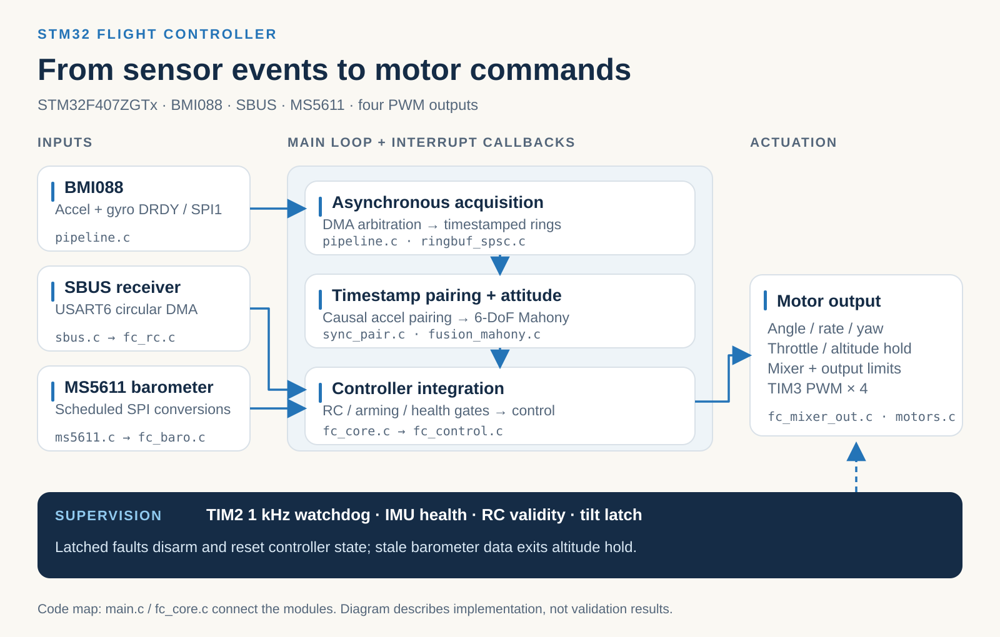
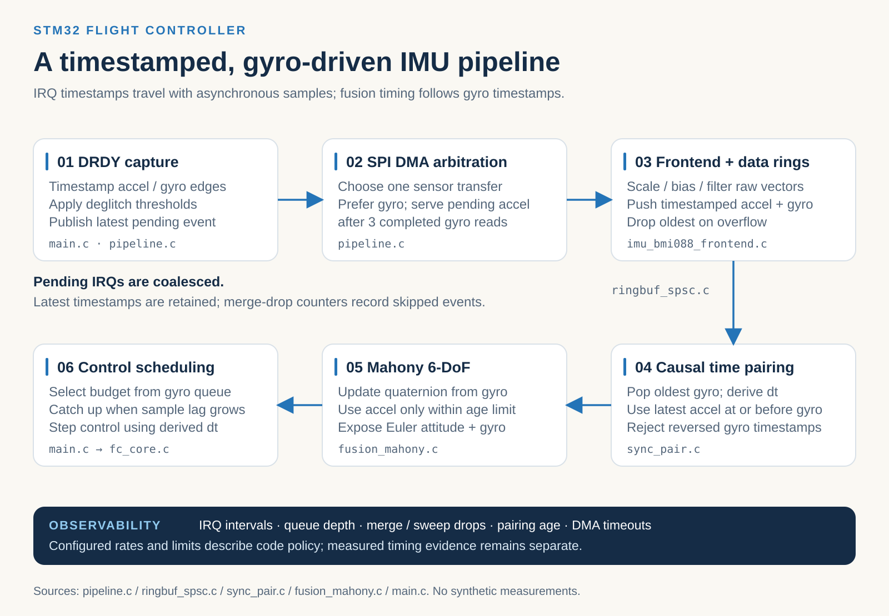
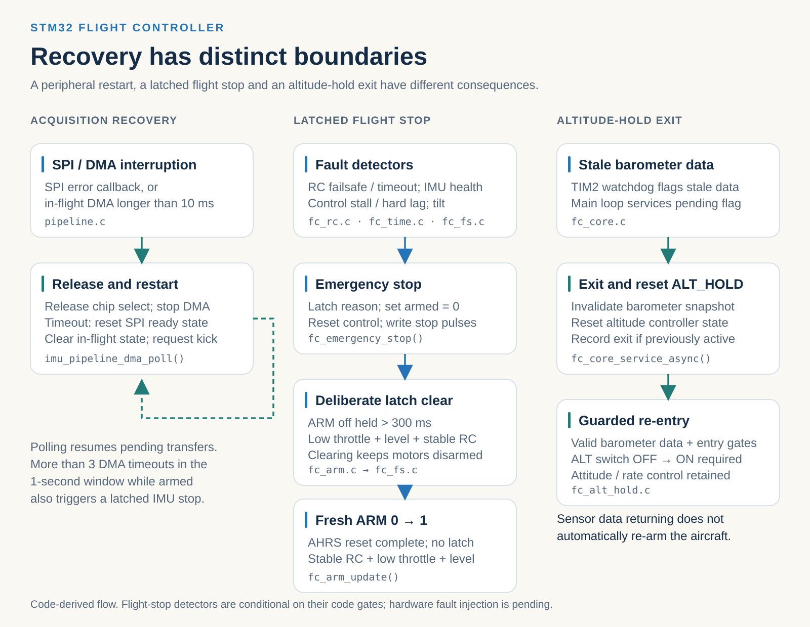
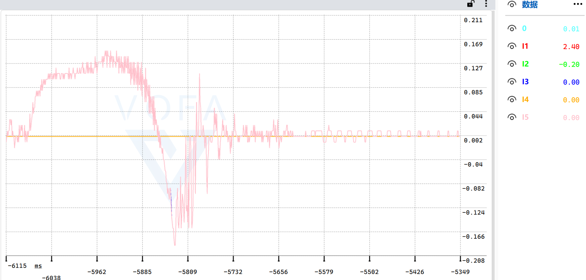
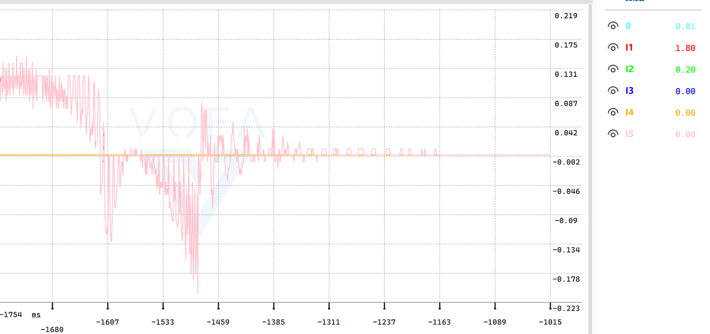

# STM32 自研飞控系统

**我基于 STM32F407 开发的一套四旋翼飞行控制固件，重点解决从传感器中断到电机输出的实时数据处理、姿态估计、闭环控制与异常保护问题。**

`STM32F407` · `BMI088` · `MS5611` · `SPI DMA` · `Ring Buffer` · `Mahony` · `Cascaded Control` · `Failsafe`

[English](README.md) · [查看固件源码](firmware/stm32/) · [Keil 编译说明](BUILD.md) · [第三方代码与版权说明](THIRD_PARTY_NOTICES.md)

## 为什么做这套飞控

对我而言，自研飞控的重点不只是让四旋翼执行 PID 控制，而是自己打通一条完整的软件链路：**传感器什么时候产生数据、如何异步读取、怎样判断数据是否仍然有效、控制任务处理不过来时怎么办，以及发生故障后电机应该如何响应。**

我以 STM32F407 为主控，围绕 BMI088 惯性传感器、MS5611 气压计、SBUS 遥控输入与四路电机输出组织固件。相比单纯叠加功能，我更关注采集、估计、控制和安全模块之间的时序与职责边界。

## 系统架构

这张图展示了我组织的主要控制链：BMI088 通过 DRDY 中断和 SPI DMA 进入采集管线；时间戳样本进入缓冲区，在主循环中完成配对、姿态估计和控制计算；最终由混控模块生成电机输出。同时，SBUS、气压计以及安全状态管理参与整个过程。

| 子系统 | 我的工程实现 |
| --- | --- |
| 主控与运行环境 | STM32F407ZGTx，Cortex-M4F；HSI/PLL 标称 168 MHz |
| IMU 采集 | BMI088 加速度计与陀螺仪独立 DRDY、SPI1 DMA、时间戳与缓冲 |
| 姿态估计 | 我编写的 Mahony 六轴四元数融合实现，使用带时间信息的陀螺仪与加速度计数据 |
| 飞行控制 | Roll/Pitch 角度外环 P + 角速度内环 PD；独立 Yaw 控制、四电机混控 |
| 高度相关模块 | 我编写的 MS5611 驱动，以及气压高度、垂直速度与定高控制代码 |
| 接收与输出 | USART6 DMA 接收 SBUS；四路 PWM 电机输出 |
| 安全与诊断 | DMA 超时恢复、数据新鲜度判定、解锁约束、故障锁存、统计与日志 |

## 我的核心设计：让传感器数据以正确的时间进入控制器

### 1. 异步采集，而不是在中断里完成全部计算

我将 BMI088 的加速度计、陀螺仪 DRDY 作为采样事件入口，在中断侧记录待处理事件和时间戳，再由 SPI DMA 传输管线异步读取数据。由于两个传感器共享采集资源，我在调度中优先服务陀螺仪，同时按策略穿插加速度计请求。

**对应源码：** [pipeline.c](firmware/stm32/Core/Src/pipeline.c) · [main.c](firmware/stm32/Core/Src/main.c)

### 2. 在采集与控制之间加入有界缓冲和时间戳配对

我使用带时间戳的 Ring Buffer 隔离采集与主循环处理，并以陀螺仪样本推进融合时间线：选择时间不晚于该陀螺仪样本的合适加速度计数据，检查数据年龄，再根据陀螺仪时间戳计算积分间隔 `dt`。对于过期的加速度计数据，融合逻辑会限制其参与校正，避免把旧样本当成当前状态。

**对应源码：** [ringbuf_spsc.c](firmware/stm32/Core/Src/ringbuf_spsc.c) · [sync_pair.c](firmware/stm32/Core/Src/sync_pair.c) · [fusion_mahony.c](firmware/stm32/Core/Src/fusion_mahony.c)

### 3. 为数据积压和传输异常定义明确的处理路径

当主循环处理速度落后于采集速度时，我没有假设队列可以无限增长，而是利用缓冲水位、样本滞后信息和追赶处理策略管理积压；必要时舍弃较旧事件或样本。SPI DMA 的超时恢复和异常升级则与正常采集路径分开处理。

这些机制是我对**实时系统在非理想条件下如何保持可预测行为**的一次具体工程实践；实际最大吞吐量、时延和抖动仍需结合板端日志测量。

**对应源码：** [pipeline.c](firmware/stm32/Core/Src/pipeline.c) · [main.c](firmware/stm32/Core/Src/main.c)

## 姿态估计与飞行控制

我编写了 `fusion_mahony.c/h`，使用 Mahony 已公开的姿态估计原理实现六轴四元数姿态融合。控制部分将 Roll/Pitch 的角度指令转换为角速度目标，再由角速度内环生成控制量；Yaw 单独处理，最后统一进入四电机混控和输出限幅。

对于气压高度链路，我还编写了 `ms5611.c/h` 并接入高度/垂直速度与定高控制模块。**代码实现和定高飞行效果是两个不同的验证层级**：目前仓库保留了这些实现，但没有提供可与本次整理固件一一对应的定高实飞数据。

**对应源码：** [Mahony](firmware/stm32/Core/Src/fusion_mahony.c) · [角度环](firmware/stm32/FlightController/fc_control/fc_angle.c) · [角速度环](firmware/stm32/FlightController/fc_control/fc_rate.c) · [Yaw](firmware/stm32/FlightController/fc_control/fc_yaw.c) · [混控](firmware/stm32/FlightController/fc_output/fc_mixer_out.c) · [MS5611](firmware/stm32/Core/Src/ms5611.c) · [定高模块](firmware/stm32/FlightController/fc_control/fc_alt_hold.c)

## 我如何处理故障与重新解锁

我在正常控制链之外保留了异常处理路径：包括 SPI/DMA 恢复尝试、传感器数据过期、遥控与解锁条件检查、停止输出以及故障后有条件重新解锁。我的设计重点是**故障不能仅凭数据恢复就直接恢复电机运行**，而要经过明确的状态转换和解锁约束。

**对应源码：** [fc_fs.c](firmware/stm32/FlightController/fc_safety/fc_fs.c) · [fc_arm.c](firmware/stm32/FlightController/fc_safety/fc_arm.c) · [fc_core.c](firmware/stm32/FlightController/fc_core/fc_core.c)

## 我的台架调试记录

在开发过程中，我使用 VOFA 记录过闭环调参时的动态响应，既保留了振荡明显的阶段，也保留了瞬态逐渐衰减的测试片段。我希望这些原始材料展示的是**真实的调试过程**，而不是只挑一张漂亮曲线冒充完整性能验证。

| 2025-12-08 · 振荡明显的瞬态 | 2025-12-08 · 响应逐渐衰减 |
| --- | --- |
|  |  |

[查看 2025-12-09 另一段双轨迹台架记录](media/bench/vofa-2025-12-09-212009.png)

这些是我当年保存的原始截图，因此这里不凭截图编造 PID 参数、超调百分比或不同测试之间的定量改进结论。后续我会按照真实素材补充机体照片、台架视频和飞行片段。

## 源码构建与项目状态

这份仓库保留了可供研究的 STM32 源码、Keil 工程、CubeMX 配置与必要的 HAL/CMSIS 依赖。使用 [fly1.0.uvprojx](firmware/stm32/MDK-ARM/fly1.0.uvprojx) 构建，详细步骤见 [BUILD.md](BUILD.md)。

我此前保存的 Keil 重建记录为 **0 Errors / 4 Warnings**，完成了链接与 HEX 生成；本次仓库精简后没有独立重新执行目标板构建。部分中断保护路径做过基于模拟原语的主机测试，但这不等于目标板上全部时序与故障路径已经验证。**本仓库用于展示源码与开发过程，不作为可直接投入飞行的安全固件发布。**

源码中将 `FC_MOTOR_TEST_ENABLE` 与 `FC_ESC_CAL_ENABLE` 默认设为 `0`。进行任何电机或台架检查前，请拆除全部桨叶。

**代码归属：** `ms5611.c/h` 和 `fusion_mahony.c/h` 的具体实现由我编写；Mahony 算法理论及传感器协议不由我声明原创。ST、Arm CMSIS、Bosch 的第三方代码遵循其原有声明。目前仓库尚未指定覆盖其余自有代码的根目录开源许可证，因而公开可见不代表全部代码已获自由使用授权。详情见 [THIRD_PARTY_NOTICES.md](THIRD_PARTY_NOTICES.md)。
